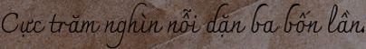

# vietnam_ocr

## In train_pytorch_ctc.py:
config.train_infofile = ['path_to_train_infofile1.txt','path_to_train_infofile2.txt']  
config.val_infofile = 'path_to_test_infofile.txt'

## Train:
python train_pytorch_ctc.py

## Evalution:
python crnn_recognizer.py

## Some example:

Prediction: Cực trăm nghìn nỗi dặn ba bốn lần

Prediction: Ta đây nào phải các thầy

Prediction: Buồng trong vội dạo sen vàng bước ra.
